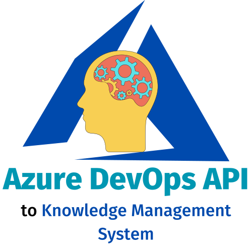

<!-- PROJECT LOGO -->
<br />
<p align="center">
  
  <div style="align:center;text-align:center">
  <a href="https://github.com/jeysgar1/azure-devops-api-kms">
    
  </a>
</div>
  <h3 align="center">Azure DevOps API KMS</h3>

  <p align="center">
    Consulta y obtiene el <p>conocimiento tácito</p> generado y documentado en cada <p>proyecto</p> creado en <p>Azure DevOps</p> dentro de la <p>organización</p> y transformalo en <p>conocimiento explícito</p>. 
    <br />
    <a href="https://jeysgar1.github.io/azure-devops-api-kms/#/"><strong>Visita nuestro sitio web »</strong></a>
    <br />
    ·
    <a href="https://github.com/jeysgar1/azure-devops-api-kms/blob/master/.github/ISSUE_TEMPLATE/bug_report.md">Reporte un error</a>
    ·
    <a href="https://github.com/jeysgar1/azure-devops-api-kms/blob/master/.github/ISSUE_TEMPLATE/feature_request.md">Solicite una nueva funcionalidad</a>
    ·
  </p>
</p>

<!-- ABOUT THE PROJECT -->
## Acerca del proyecto

Esta <b>librería</b> nace a partir de una situación personal en la cuál una <b>organización</b> le da la potestad a cada proyecto en <b>gestionar</b> las <b>épicas y características</b>, generando <b>duplicidad de las mismas</b> en <b>otros proyectos</b> y complicando la <b>búsqueda</b>, <b>uso</b> y <b>relación</b> entre las <b>creadas previamente</b>.

Asumiendo una igualdad entre la definición de <b>conocimiento tácito</b> y la <b>duplicidad de la información, la no relación de las mismas y la dificultad para consultar información histórica</b> sobre las <b>épicas</b>, las <b>características</b>, las <b>historias de usuario</b> y las <b>tareas</b>, se propone una <b>restructuración de la definición existente</b> sin generar cambios en el proceso ya establecido en <b>Azure Devops</b>. 

¿Necesitas un poco más de información? 
- Visita [Knowledge Management System](./concepts/kms.md) en donde te explicaré qué es conocimiento tácito y conocimiento explícito
- Visita [Azure DevOps](./concepts/azure.md) en donde te explicaré qué es <b>Azure DevOps</b>, qué son los <b>elementos de trabajo</b> y cómo acceder a ellos mediante una <b>API REST</b>. 
- Visita [Pérdida de conocimiento por modo de trabajo en Azure Devops](./app/problem.md) en donde especificaré un poco más cuál es el problema o cuál es la motivación para implementar esta librería. 

### Frameworks o librerías utilizadas

A continuación, enlistaré los frameworks o librerías que fueron incluidas dentro de la solución categorizadas en : la automatización pruebas, la documentación del proyecto, manejador de dependencias, las buenas practicas de codificación, el core del aplicativo y las utilitarias.

[Axios]: https://img.shields.io/badge/AXIOS-blue?style=for-the-badge&logo=axios&logoColor=white&labelColor=333
[Axios-url]: https://axios-http.com/docs/intro

[Cucumber]: https://img.shields.io/badge/CUCUMBER-green?style=for-the-badge&logo=cucumber&logoColor=white&labelColor=black
[Cucumber-url]: https://www.npmjs.com/package/jest-cucumber

[Docsify]: https://img.shields.io/badge/DOCSIFY-green?style=for-the-badge&logo=docsify&logoColor=white&labelColor=black
[Docsify-url]: https://docsify.js.org/#/?id=docsify

[Eslint]: https://img.shields.io/badge/ESLINT-purple?style=for-the-badge&logo=eslint&logoColor=white&labelColor=black
[Eslint-url]: https://eslint.org/

[Github]: https://img.shields.io/badge/GITHUB-purple?style=for-the-badge&logo=github&logoColor=white&labelColor=black
[Github-url]: https://github.com/

[Husky]: https://img.shields.io/badge/HUSKY-333?style=for-the-badge&logo=nodedotjs&logoColor=black&labelColor=green
[Husky-url]: https://typicode.github.io/husky/

[Jest]: https://img.shields.io/badge/JEST-red?style=for-the-badge&logo=jest&logoColor=white&labelColor=black
[Jest-url]: https://jestjs.io/

[Node.js]: https://img.shields.io/badge/Node.JS-333?style=for-the-badge&logo=nodedotjs&logoColor=black&labelColor=green
[Node-url]: https://nodejs.org/es


[NPM]: https://img.shields.io/badge/NPM-333?style=for-the-badge&logo=npm&logoColor=black&labelColor=green
[NPM-url]: https://www.npmjs.com/
[PNPM]: https://img.shields.io/badge/PNPM-333?style=for-the-badge&logo=pnpm&logoColor=black&labelColor=yellow
[PNPM-url]: https://pnpm.io/es/motivation

[Prettier]: https://img.shields.io/badge/PRETTIER-black?style=for-the-badge&logo=prettier&logoColor=white&labelColor=black
[Prettier-url]: https://prettier.io/

[Rimraf]: https://img.shields.io/badge/RIMRAF-green?style=for-the-badge&logo=nodedotjs&logoColor=white&labelColor=black
[Rimraf-url]: https://www.npmjs.com/package/rimraf

[Typedoc]: https://img.shields.io/badge/TYPEDOC-333?style=for-the-badge&logo=nodedotjs&logoColor=white&labelColor=black
[Typedoc-url]: https://typedoc.org/

<div style="width:100%; display:inline-block">
<div style="float:left;width:45%">

1. Core del aplicativo

* [![Axios][Axios]][Axios-url]
* [![NodeJS][Node.js]][Node-url]

2. Automización de pruebas 

* [![Jest][Jest]][Jest-url]
* [![Cucumber][Cucumber]][Cucumber-url]
* [![Github][Github]][Github-url]
* [![Husky][Husky]][Husky-url]

3. Documentación del proyecto 

* [![Docsify][Docsify]][Docsify-url]
* [![Typedoc][Typedoc]][Typedoc-url]
</div>

<div style="float:right;width:45%">
4. Buenas prácticas de desarrollo de software 

* [![Eslint][Eslint]][Eslint-url]
* [![Prettier][Prettier]][Prettier-url]

5. Manejaador de dependencias 

* [![NPM][NPM]][NPM-url]
* [![PNPM][PNPM]][PNPM-url]

6. Utilitarias

* [![Rimraf][Rimraf]][Rimraf-url]

</div>
</div>

<!-- GETTING STARTED -->
## Guías

A continuación, se brindarán los instructivos que dede seguir un desarrollador para hacer uso del aplicativo en una aplicación externa.  

### Pre-requisitos

1. Descargar e instalar <a href="https://nodejs.org/en/download">NodeJS & NPM</a> 
2. Descargar e instalar <a href="https://git-scm.com/downloads">Git</a>

#### Validación 

1. Ejecutar en un consola de comandos:

```cmd
npm -v
```


2. Ejecutar en una consola de comandos :

```cmd
node -v
```


3. Ejecutar en una consola de comandos :

```cmd
git --version
```


### Instalación

1. A criterio de la fábrica de software o del desarrollador, desde el entorno de desarrollo integrado o desde el editor de texto, instalar el paquete desde la consola de comandos en la ruta del diretorio físico del aplicativo a construir. 

```cmd
npm i azure-devops-api-kms
```


2. Instale las dependencias

```cmd
pnpm install
```

Posiblemente al ejecutar este comando le instalará globalmente otras dependencias que son necesarias para el mismo como <b>typescript</b>, <b>jest</b>, <b>docsify-cli</b> y el gestor de dependencias <b>pnpm</b>.

<!-- USAGE EXAMPLES -->
## Usage

Use this space to show useful examples of how a project can be used. Additional screenshots, code examples and demos work well in this space. You may also link to more resources.

_For more examples, please refer to the [Documentation](https://example.com)_


<!-- ROADMAP -->
## 🚧 Roadmap

See the [open issues](https://github.com/roshanlam/ReadMeTemplate/issues) for a list of proposed features (and known issues).


<!-- CONTRIBUTING -->
## 🤝 Colaboraciones

Contributions are what make the open source community such an amazing place to be learn, inspire, and create. Any contributions you make are **extremely appreciated**.

1. Fork the Project
2. Create your Feature Branch (`git checkout -b feature/AmazingFeature`)
3. Commit your Changes (`git commit -m 'Add some AmazingFeature'`)
4. Push to the Branch (`git push origin feature/AmazingFeature`)
5. Open a Pull Request

### Pre-requisitos

1. Descargar e instalar <a href="https://nodejs.org/en/download">NodeJS & NPM</a> 
2. Descargar e instalar <a href="https://git-scm.com/downloads">Git</a>
3. Descargar e instalar <a href="https://code.visualstudio.com/Download">Visual Studio Code</a> (o el editor de texto o entorno de desarrollo integrador que más les guste) 
4. Clonar el proyecto alojado en Github.

#### Validación 

1. Ejecutar en un consola de comandos:

```cmd
npm -v
```


2. Ejecutar en una consola de comandos :

```cmd
node -v
```


3. Ejecutar en una consola de comandos :

```cmd
git --version
```


4. Clonar el proyecto alojado en Github mediante el comando:

```cmd
git clone https://github.com/jeysgar1/azure-devops-api-kms.git
```

Después de ser clonado, validar que fueron descargados los archivos en su directorio local para dar por finalizado los pre-requisitos.

<!-- LICENSE -->
## 📝 License
Describe your License for your project. 

Distributed under the MIT License. See `LICENSE` for more information.


<!-- CONTACT -->
## 📫 Contact

Jeyson Andrés García Rodríguez - [@jeysgar1](https://www.linkedin.com/in/jeissongarcia) - jeogarod@gmail.com

Github: [https://github.com/jeysgar1/azure-devops-api-kms](https://github.com/jeysgar1/azure-devops-api-kms)


<!-- ACKNOWLEDGEMENTS -->
## Acknowledgements
* [Img Shields](https://shields.io)
* [GitHub Pages](https://pages.github.com)
* [Font Awesome](https://fontawesome.com)
* blah blah blah....
