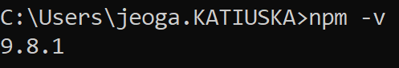
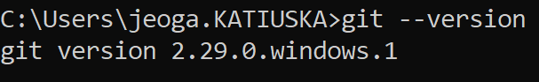
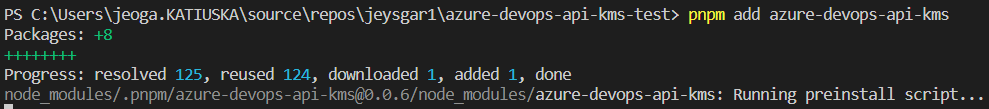

<h1>Azure DevOps API KMS</h1>

<h2>Acerca del proyecto</h2> 

<p>
Esta <b>librería</b> nace a partir de una situación personal en la cuál una <b>organización</b> le da la potestad a cada proyecto en <b>gestionar</b> las <b>épicas y características</b> en <b>Azure DevOps</b>, generando <b>duplicidad de las mismas</b> en <b>otros proyectos</b> y complicando la <b>búsqueda</b>, el <b>uso</b> y la <b>relación</b> entre las <b>creadas previamente</b>.</p>

<p>
Asumiendo una igualdad entre la definición de <b>conocimiento tácito</b> y la <b>duplicidad de la información, la no relación de las mismas y la dificultad para consultar información histórica</b> sobre las <b>épicas</b>, las <b>características</b>, las <b>historias de usuario</b> y las <b>tareas</b>, se propone una <b>restructuración de la definición existente</b> sin generar cambios en el proceso ya establecido en <b>Azure Devops</b> para transformar ese <b>conocimiento tácito</b> en <b>conocimiento explícito</b>. 
</p>

<p>
¿Necesitas un poco más de información? 
<ul>
<li>Visita <a href="https://jeysgar1.github.io//#/./concepts/kms"></a>Knowledge Management System</a> en donde te explicaré qué es conocimiento tácito y conocimiento explícito</li>
<li>Visita <a href="https://jeysgar1.github.io/#/./concepts/azure"></a>Azure DevOps</a> en donde te explicaré qué es <b>Azure DevOps</b>, qué son los <b>elementos de trabajo</b> y cómo acceder a ellos mediante una <b>API REST</b></li>
<li>Visita <a href="https://jeysgar1.github.io/#/./app/problem"></a>¿Por qué gestionar el conocimiento TI junto a Azure DevOps?</a> en donde especificaré un poco más cuál es el problema o cuál es la motivación para implementar esta librería. </li>
</p>

<h2>Frameworks o librerías utilizadas</h2>

<p>
A continuación, enlistaré los frameworks o librerías que fueron incluidas dentro de la solución categorizadas en :  automatización pruebas,  documentación del proyecto, manejador de dependencias, buenas practicas de codificación,  core del aplicativo y utilitarias.</p>

[Axios]: https://img.shields.io/badge/AXIOS-blue?style=for-the-badge&logo=axios&logoColor=white&labelColor=333
[Axios-url]: https://axios-http.com/docs/intro

[Cucumber]: https://img.shields.io/badge/CUCUMBER-green?style=for-the-badge&logo=cucumber&logoColor=white&labelColor=black
[Cucumber-url]: https://www.npmjs.com/package/jest-cucumber

[Docsify]: https://img.shields.io/badge/DOCSIFY-green?style=for-the-badge&logo=docsify&logoColor=white&labelColor=black
[Docsify-url]: https://docsify.js.org/#/?id=docsify

[Eslint]: https://img.shields.io/badge/ESLINT-purple?style=for-the-badge&logo=eslint&logoColor=white&labelColor=black
[Eslint-url]: https://eslint.org/

[Github]: https://img.shields.io/badge/GITHUB-purple?style=for-the-badge&logo=github&logoColor=white&labelColor=black
[Github-url]: https://github.com/

[Husky]: https://img.shields.io/badge/HUSKY-333?style=for-the-badge&logo=nodedotjs&logoColor=black&labelColor=green
[Husky-url]: https://typicode.github.io/husky/

[Jest]: https://img.shields.io/badge/JEST-red?style=for-the-badge&logo=jest&logoColor=white&labelColor=black
[Jest-url]: https://jestjs.io/

[Node.js]: https://img.shields.io/badge/Node.JS-333?style=for-the-badge&logo=nodedotjs&logoColor=black&labelColor=green
[Node-url]: https://nodejs.org/es


[NPM]: https://img.shields.io/badge/NPM-333?style=for-the-badge&logo=npm&logoColor=black&labelColor=green
[NPM-url]: https://www.npmjs.com/
[PNPM]: https://img.shields.io/badge/PNPM-333?style=for-the-badge&logo=pnpm&logoColor=black&labelColor=yellow
[PNPM-url]: https://pnpm.io/es/motivation

[Prettier]: https://img.shields.io/badge/PRETTIER-black?style=for-the-badge&logo=prettier&logoColor=white&labelColor=black
[Prettier-url]: https://prettier.io/

[Rimraf]: https://img.shields.io/badge/RIMRAF-green?style=for-the-badge&logo=nodedotjs&logoColor=white&labelColor=black
[Rimraf-url]: https://www.npmjs.com/package/rimraf

[Typedoc]: https://img.shields.io/badge/TYPEDOC-333?style=for-the-badge&logo=nodedotjs&logoColor=white&labelColor=black
[Typedoc-url]: https://typedoc.org/


* [![Axios][Axios]][Axios-url]
* [![NodeJS][Node.js]][Node-url]
* [![Eslint][Eslint]][Eslint-url]
* [![Prettier][Prettier]][Prettier-url]
* [![Jest][Jest]][Jest-url]
* [![Cucumber][Cucumber]][Cucumber-url]
* [![Github][Github]][Github-url]
* [![Husky][Husky]][Husky-url]
* [![Docsify][Docsify]][Docsify-url]
* [![Typedoc][Typedoc]][Typedoc-url]
* [![NPM][NPM]][NPM-url]
* [![PNPM][PNPM]][PNPM-url]
* [![Rimraf][Rimraf]][Rimraf-url]


<h2>Guías</h2>

<p>
A continuación, se brindarán los instructivos que dede seguir un desarrollador para hacer uso del aplicativo en una aplicación externa. 
</p> 

<h3>Pre-requisitos</h3>

1. Descargar e instalar <a href="https://nodejs.org/en/download">NodeJS & NPM</a> 
2. Descargar e instalar <a href="https://git-scm.com/downloads">Git</a>

<h4>Validaciones</h4>

1. Ejecutar en un consola de comandos:

```cmd
npm -v
```


2. Ejecutar en una consola de comandos :

```cmd
node -v
```


3. Ejecutar en una consola de comandos :

```cmd
git --version
```


4. Ejecutar en una consola de comandos:

```cmd
npm install -g pnpm
```

<h3>Instalación</h3>

1. Adicionar el paquete <b>azure-devops-api-kms</b> a través del gestor de dependencias <b>pnpm</b> en la ruta del directorio fisico del proyecto que está siendo creado a través del siguiente comando

```cmd
pnpm add azure-devops-api-kms
```

Ejecutar el siguiente comando para garantizar la instalación del mismo:

```cmd
pnpm install
```

Problamemente podrás visualizar que la instalación lanza un conjunto de instalaciones secundarias globales que son utiles para el proyecto como : <b>typescript</b>, <b>docsify-cli</b>, <b>typedoc</b>, <b>jest</b> y <b>webpack</b>. 



<h3>Casos de uso</h3>

1. <a href="">Consultar por un identificador en común</a>

<h2>🚧 Roadmap</h2>

<h3>1. Búsqueda por un identificador en común</h3>
<p>Se debe implementar una consulta sobre todos los elementos de trabajo de todos los proyectos de la organización que compartan un mismo campo personalizado con el mismo valor</p>

<h4>2. Búsqueda por palabras claves</h4>
<p>Se debe implementar una consulta sobre todos los elementos de trabajo de todos los proyectos de la organización que compartan por lo menos un de un conjunto de palabras claves en la descripción del elemento del trabajo</p> 

<h2>🤝 Colaboraciones</h2>

Pendiente por definir el proceso. 

<!-- CONTACT -->
<h2>📝 Contacto</h2>

Jeyson Andrés García Rodríguez - [@jeysgar1](https://www.linkedin.com/in/jeissongarcia) - jeogarciarodriguez@hotmail.com

Github: [https://github.com/jeysgar1/azure-devops-api-kms](https://github.com/jeysgar1/azure-devops-api-kms)

<!-- ACKNOWLEDGEMENTS -->
<h2>Agradecimientos</h2>

A [Harold Andrés Marroquín Veloza](https://www.linkedin.com/in/harold-marroquin-b5964a250/), por acompañarme en cada situación dificil y en siempre darme los ánimos que necesito para continuar y pensar que mis ideas no son en vano. 
