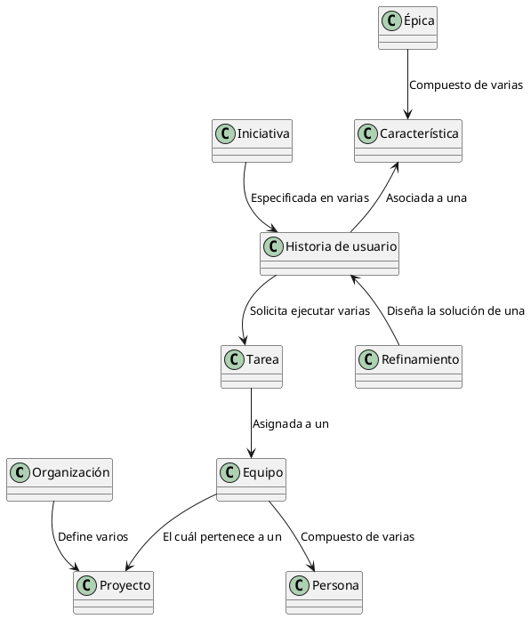

<h1>Azure DevOps : tácito a explícito</h1>

```plantuml
@startuml
class "Organización" {
}

class Proyecto {
  
}

class Iniciativa {
  
}

class "Historia de usuario" {
  
}

class "Épica" {
  
}

class "Característica" {
  
}

class Tarea {
  
}

class Refinamiento {
  
}

class Equipo {
  
}

class Persona {
  
}

"Organización"  -->  Proyecto : Define varios
Iniciativa --> "Historia de usuario" : Especificada en varias
"Épica" --> "Característica" : Compuesto de varias
"Característica" <-- "Historia de usuario" : Asociada a una
"Historia de usuario" --> Tarea : Solicita ejecutar varias
"Historia de usuario" <-- Refinamiento : Diseña la solución de una
Tarea --> Equipo : Asignada a un
Equipo --> Proyecto : El cuál pertenece a un
Equipo --> Persona : Compuesto de varias
@enduml
```