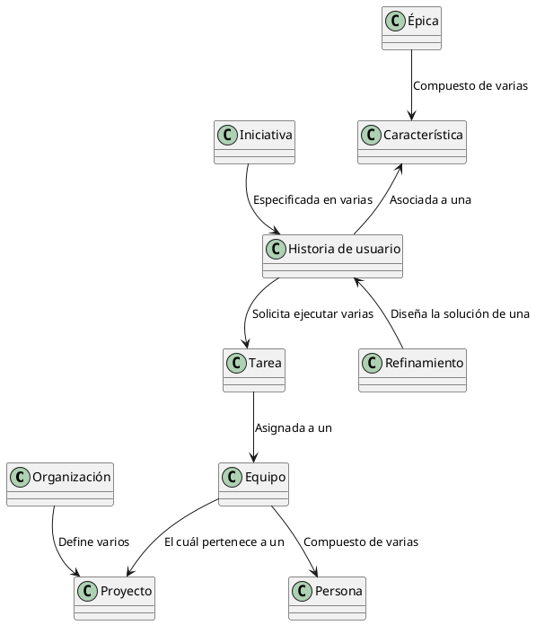

<h1>Azure DevOps : Tácito a explícito</h1>

La propuesta que realiza esta librería o framework es la siguiente : 

1. La <b>Organización</b> se comportará igual a como <b>Azure DevOps</b> la define y como a hoy su compañía la utiliza. 

2. Los <b>Proyectos</b> se comportarán igual a como <b>Azure DevOps</b> los define y como a hoy su compañía los utiliza. 

3. Las <b>necesidades de los usuarios</b> o de los <b>Product Owner</b> representan directamente una <b>Iniciativa</b>. Las <b>Iniciativas</b> serán representadas por un identificador. Por lo pronto, cualquier análisis de viabilidad financiero y técnico sobre este seguirá pertenenciendo a cómo hoy lo defina la compañía. 

4. Las <b>Iniciativas</b> serán especificadas por los <b>Proxy</b> durante un conjunto de sesiones de entendimiento con los <b>Product Owner</b>.

5. Cada <b>Iniciativa</b> será especificada mediante la escritura de las <b>Historias de usuario</b>. Cuando las <b>Historias de usuario</b> sean especificadas, se podrá asociar una <b>Característica</b> de una <b>Épica</b>. Puede darse el caso de que no exista una <b>Característica</b> para una <b>Épica</b>, que no exista la <b>Épica</b> o qué ambas ya existan. Sea cual sea el caso, las <b>Épicas</b> y las <b>Características</b> deben ser compartidas entre las <b>Iniciativas</b>. 

6. La asociación <b>Historia de usuario</b> - <b>Característica</b> - <b>Épica</b> permitirá que tanto el <b>Proxy</b> como el <b>Arquitecto</b> puedan <b>Refinar</b> la <b>Historia de usuario</b>. Este refinamiento cumple la <b>tarea</b> de <b>diseñar</b> la <b>solución técnica</b> desencadenando las <b>Tareas</b> que deben ejecutar los <b>proyectos</b> que se <b>requieran</b>.

Lo anterior nos permitirá <b>consultar históricamente un tópico o tema</b>, una <b>funcionalidad</b>, un <b>diseño propuesto</b> y los <b>responsables</b> de los elementos de trabajo creados al rededor de los <b>proyectos</b> de una <b>organización</b> en <b>Azure DevOps</b>. 