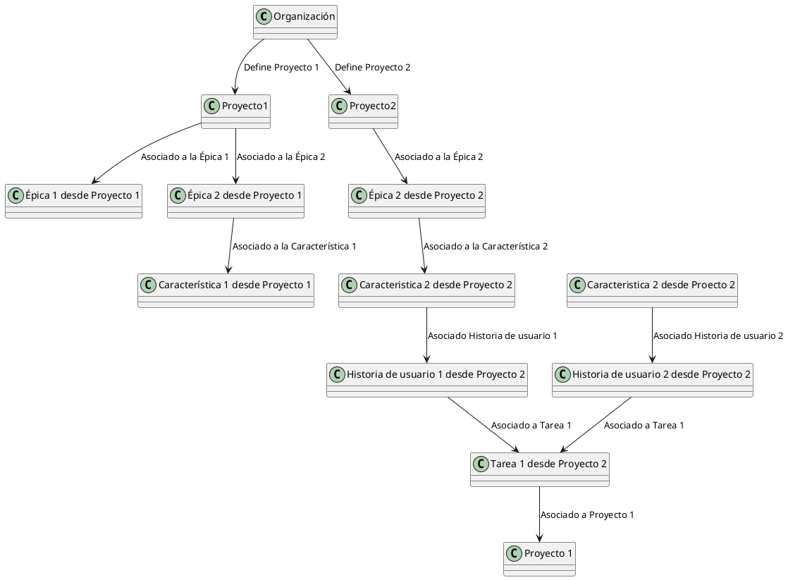

<h1>Problema a solucionar</h1>

Esta <b>librería</b> nace a partir de una <b>necesidad personal</b> : la <b>búsqueda</b> y la <b>relación</b> entre los <b>elementos de trabajo</b> de diversos <b>proyectos</b> que fueron creados dentro de una <b>organización</b> en <b>Azure DevOps</b>.  <b>Azure DevOps</b> es una plataforma <b>SaaS</b> (<b>Software as a Service</b>) que permite <b>gestionar todos los proyectos</b>, <b>procesos</b>, <b>aplicativos</b> y <b>requerimientos</b> dentro de una <b>organización</b>. Sin embargo, la herramienta es bastante permisible a la hora de crear un <b>proyecto</b>, una <b>épica</b>, una <b>característica</b>, una <b>historia de usuario</b>, una <b>tarea</b> u otro <b>elemento de trabajo</b>. 

Supongamos el caso de una <b>organización</b> que tiene varios <b>proyectos</b>, cada uno asumiendo un <b>aplicativo front-end</b>, <b>back-end</b> o <b>API</b>. Cada que se genera una <b>necesidad el usuario</b>, se <b>crea una épica</b> sin mirar el historial de las existentes al igual que las <b>características</b>. Esto sucede por cada <b>proyecto</b> que debe asumir una <b>tarea</b> para lograr el <b>objetivo en común</b>. Es decir, existen <b>épicas</b>, <b>características</b> e <b>historias de usuario</b> <b>duplicadas</b>, <b>levemente relacionadas</b> y que pueden <b>complicar la búsqueda</b> y el <b>uso para futuras solicitudes</b>.

En este modelo de trabajo, cada <b>necesidad del usuario</b> se expresa como un <b>nuevo requerimiento</b>, a excepción de la <b>correción de una funcionalidad</b> en <b>ambiente productivo</b>. En cualquier caso, las <b>épicas</b> y las <b>características</b> son <b>documentadas para las historias de usuario</b> que <b>desencadenaron la implementación</b> o <b>mantenimiento del aplicativo</b>. Lo anterior significa que en dado caso se quisiera consultar una épica y una característica transversalmente en la organización, tendriamos que manipular las consultas para que valide el sin fin de posibilidades como por ejemplo : en el nombre, en la descripción, en el hipervínculo, en un campo personalizado, y otras. Esto solo desencadena una compleja búsqueda de datos, un mal versionamiento de funciones puestas en producción, y un inexistente roadmap de un producto y su integración con otro.