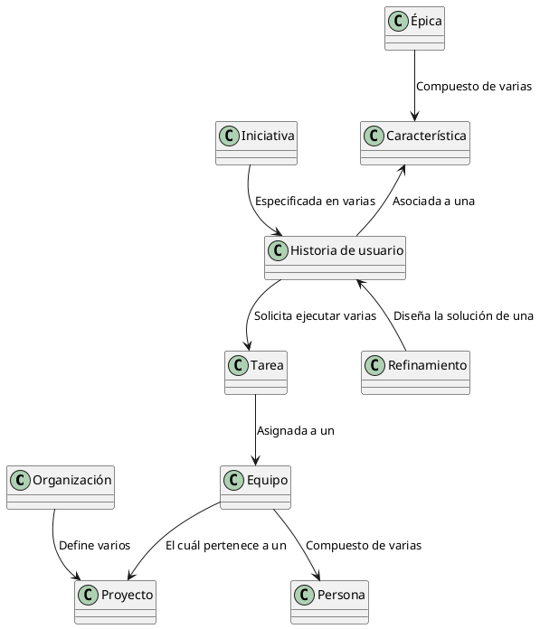

<h1>Azure DevOps</h1>

<b>Azure DevOps</b> es una plataforma <b>SaaS</b> (<b>Software as a Service</b>) que provee <b>Microsoft</b> dentro de la nube de <b>Azure</b> en la cuál un equipo de trabajo puede apoyarse para optimizar y automatizar el ciclo de vida de desarrollo de un aplicativo a partir de <b>teorías</b>, <b>recomendaciones</b> y <b>buenas prácticas</b> como <b>DevOps</b>, <b>SCRUM</b>, <b>KANBAN</b>, <b>LEAN</b>, entre otras. 

El principal componente en <b>Azure DevOps</b> es la <b>Organización</b>. La <b>Organización</b> representa la compañía, la cuál define uno o varios <b>Proyectos</b>. A criterio de cada compañia, un <b>Proyecto</b> puede representar un <b>equipo</b>, más de un equipo o a una <b>aplicación</b>. <b>Azure DevOps</b> permite que cada proyecto defina su propio proceso : <b>SCRUM</b>, <b>KANBAN</b> o interno de la compañía. Sea cuál sea el proceso definido, cada <b>proyecto</b> define quiénes son sus <b>participantes</b> (<b>personas</b>) formando un <b>Equipo</b>.  

Los <b>Equipos</b> cumplen la función de llevar a cabo la necesidad de un usuario o dueño del producto (<b>Product Owner</b>). Para esto, cada <b>Equipo</b> define los <b>roles</b> que internamente asumiran las <b>Personas</b> integrantes. En la metodología SCRUM, los roles que por defecto deben existir dentro de un equipo son : <b>Scrum Master</b>, <b>Product Owner</b> y el  <b>Scrum Team</b>. <b>Scrum Master</b> o el experto en Scrum es la persona encargada de mantener el orden y los lineamientos de la metodología dentro del equipo para lograr los objetivos que se propongan durante cada <b>Sprint</b> según el <b>Product Backlog</b> definido junto al <b>Product Owner</b>. El <b>Product Owner</b> es el dueño del producto, es quién conoce lo que se necesita, cómo se necesita y cuál es el alcance deseado. Ese producto es finalmente desarrollado por un <b>Scrum Team</b>. El <b>Scrum Team</b> representa todos los desarrolladores, téster, diseñadores, documentadores, entre otros que aportan un grano de arena para lograr la meta. 

A partir del <b>Product BackLog</b> y durante cada inicio del <b>Sprint</b>, todos los integrantes del <b>Equipo</b> seleccionan qué <b>Épicas</b>, <b>Características</b>, <b>Historias de usuario</b> y <b>Tareas</b> que serán ejecutadas durante ese periodo de tiempo. Las <b>Épicas</b>, <b>Características</b>, <b>Historias de usuario</b> y <b>Tareas</b> son denominadas <b>elementos de trabajo</b> y permiten trazar las tareas que se han realizado sobre un producto y las funcionalidades que han sido puestas en un ambiente de pruebas y productivo. 

Durante el <b>ciclo de vida</b> de una <b>necesidad del usuario</b>, de un proyecto o de la misma organización, se genera eventualmente la necesidad de consultar la información almacenada en los elementos de trabajo, es por eso que <b>Azure DevOps</b> dispone de una <b>API REST</b>, la cuál es accedida mediante un <b>PAT</b> y sobre la cuál se pueden proponer proyectos como <b>Azure DevOps API KMS</b>. 

