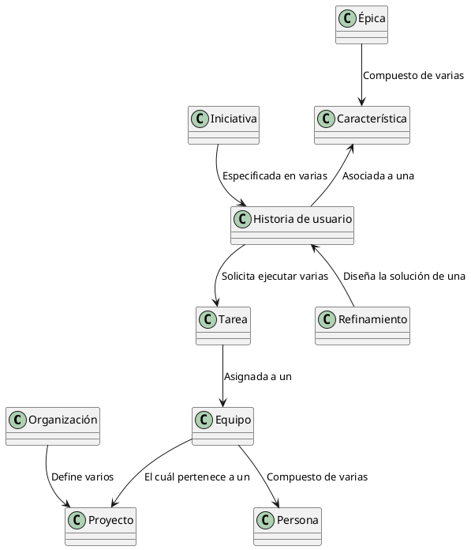

<h1>Azure DevOps</h1>

<b>Azure DevOps</b> es una plataforma <b>SaaS</b> (<b>Software as a Service</b>) que provee <b>Microsoft</b> dentro de la nube de <b>Azure</b> en la cuál un equipo de trabajo puede apoyarse para optimizar y automatizar el ciclo de vida de desarrollo de un aplicativo a partir de <b>teorías</b>, <b>recomendaciones</b> y <b>buenas prácticas</b> como <b>DevOps</b>, <b>SCRUM</b>, <b>KANBAN</b>, <b>LEAN</b>, entre otras. 

En <b>Azure DevOps</b>, el principal componente es la <b>Organización</b>. La <b>Organización</b> representa la compañía, la cuál define uno o varios <b>Proyectos</b>. A criterio de cada compañia, un <b>Proyecto</b> puede representar a un <b>equipo</b>, más de un equipo o a una <b>aplicación</b>. <b>Azure DevOps</b> permite que cada proyecto defina su propio proceso : <b>SCRUM</b>, <b>KANBAN</b> o interno de la compañía. Al definir su proceso, puede dar inicio a la <b>definición de un tablero</b>, al uso de un <b>repositorio</b> y a la <b>publicación de artefactos</b>. Sea cuál sea el proceso definido, cada <b>proyecto</b> define quiénes son sus <b>participantes</b> (<b>personas</b>) formando un <b>Equipo</b>.   

Cada que el dueño del producto (<b>Product Owner</b>)