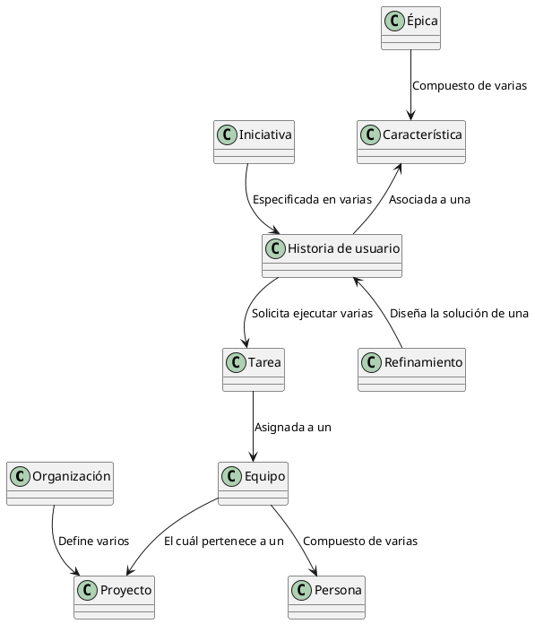

<h1>Azure DevOps</h1>

<b>Azure DevOps</b> es una plataforma <b>SaaS</b> (<b>Software as a Service</b>) que provee <b>Microsoft</b> dentro de la nube de <b>Azure</b> en la cuál un equipo de trabajo puede apoyarse para optimizar y automatizar el ciclo de vida de desarrollo de un aplicativo a partir de <b>teorías</b>, <b>recomendaciones</b> y <b>buenas prácticas</b> como <b>DevOps</b>, <b>SCRUM</b>, <b>KANBAN</b>, <b>LEAN</b>, entre otras. 

En <b>Azure DevOps</b>, el principal componente es la <b>Organización</b>. La <b>Organización</b> representa la compañía, la cuál define uno o varios <b>Proyectos</b>. A criterio de cada compañia, un <b>Proyecto</b> puede representar a un <b>equipo</b>, más de un equipo o a una <b>aplicación</b>. <b>Azure DevOps</b> permite que cada proyecto defina su propio proceso : <b>SCRUM</b>, <b>KANBAN</b> o interno de la compañía. Al definir su proceso, puede dar inicio a la <b>definición de un tablero</b>, al uso de un <b>repositorio</b> y a la <b>publicación de artefactos</b>. Sea cuál sea el proceso definido, cada <b>proyecto</b> define quiénes son sus <b>participantes</b> (<b>personas</b>) formando un <b>Equipo</b>.   

Los <b>Equipos</b> existen gracias a las <b>necesidades del usuario</b> o del <b>dueño del producto</b> (<b>Product Owner</b>). Cada que el dueño del producto manifiesta una necesidad, se crea una <b>Iniciativa</b>, las iniciativas van acompañadas de un análisis, una viabilidad y una macro-estimación. Cuando financieramente y técnicamente es aprobada, es asignada a un <b>Proxy</b>, el cuál cumple la función de <b>analista de requerimientos</b>. A partir de las reuniones de entendimiento que tanto el <b>Proxy</b> como el <b>Product Owner</b> consideren necesarias, se especifican las <b>Historias de usuario</b> y se asocian las <b>Características</b> y las <b>Epícas</b>. 

Las <b>Épicas</b> y las <b>Características</b> no pertenecen a una iniciativa, un proyecto, un equipo o una aplicación, por el contrario, una <b>Épica</b> y una <b>Característica</b> deben ser transversales a la <b>Organización</b>. Esto permite que todos los <b>Proyectos</b> esten al tanto de la existencia de una <b>Funcionalidad</b> sobre una <b>Aplicación</b> y un <b>Canal</b>. Lastimosamente, <b>Azure DevOps</b> permite que exista una misma <b>Épica</b> creada en más de un <b>Proyecto</b> sin ser relacionada complicando la búsqueda histórica, el mapeo y el versionamiento de las mismas. 

Al separar las <b>Épicas</b> y las <b>Características</b> de un <b>Proyecto</b> en particular, cada <b>Iniciativa</b> queda como responsable de las <b>Historias de usuario</b>.
Cada <b>Historia de usuario</b> se asocia a una <b>Característica</b> existente o nueva y 
desarolla la necesidad de ejecutar un conjunto de <b>Tareas</b> a partir del análisis y diseño de la solución propuesta en el <b>Refinamiento</b>. Este modelo de trabajo elimina la duplicidad de <b>Historias de usuario</b> entre proyectos y la pérdida de asociación de <b>Tareas</b> entre los <b>Equipos</b> y las <b>Personas</b>.