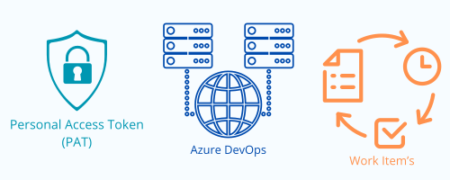

<h1>Azure DevOps</h1>

    <h2>¿Qué es?</h2>
    

        <b>Azure DevOps</b> es una plataforma <b>SaaS</b> (<b>Software as a Service</b>) que provee <b>Microsoft</b> dentro de la nube de <b>Azure</b> en la cuál un equipo de trabajo puede apoyarse para optimizar y automatizar el ciclo de vida de desarrollo de un aplicativo a partir de <b>teorías</b>, <b>recomendaciones</b> y <b>buenas prácticas</b> como <b>DevOps</b>, <b>SCRUM</b>, <b>KANBAN</b>, <b>LEAN</b>, entre otras. 
    

    <h2>¿Elementos de trabajo?</h2>
    

        El principal componente en <b>Azure DevOps</b> es la <b>Organización</b>. La <b>Organización</b> representa la compañía, la cuál define uno o varios <b>Proyectos</b>. A criterio de cada compañia, un <b>Proyecto</b> puede representar un <b>equipo</b>, más de un equipo o a una <b>aplicación</b>. <b>Azure DevOps</b> permite que cada proyecto defina su propio proceso : <b>SCRUM</b>, <b>KANBAN</b> o interno de la compañía. Sea cuál sea el proceso definido, cada <b>proyecto</b> define quiénes son sus <b>participantes</b> (<b>personas</b>) formando un <b>Equipo</b>.  
    

    

        Los <b>Equipos</b> cumplen la función de llevar a cabo la necesidad de un usuario o dueño del producto (<b>Product Owner</b>). Para esto, cada <b>Equipo</b> define los <b>roles</b> que internamente asumiran las <b>Personas</b> integrantes. En la metodología SCRUM, los roles que por defecto deben existir dentro de un equipo son : <b>Scrum Master</b>, <b>Product Owner</b> y el  <b>Scrum Team</b>. <b>Scrum Master</b> o el experto en Scrum es la persona encargada de mantener el orden y los lineamientos de la metodología dentro del equipo para lograr los objetivos que se propongan durante cada <b>Sprint</b> según el <b>Product Backlog</b> definido junto al <b>Product Owner</b>. El <b>Product Owner</b> es el dueño del producto, es quién conoce lo que se necesita, cómo se necesita y cuál es el alcance deseado. Ese producto es finalmente desarrollado por un <b>Scrum Team</b>. El <b>Scrum Team</b> representa todos los desarrolladores, téster, diseñadores, documentadores, entre otros que aportan un grano de arena para lograr la meta. 
    

    

        A partir del <b>Product BackLog</b> y durante cada inicio del <b>Sprint</b>, todos los integrantes del <b>Equipo</b> seleccionan qué <b>Épicas</b>, <b>Características</b>, <b>Historias de usuario</b> y <b>Tareas</b> que serán ejecutadas durante ese periodo de tiempo. Las <b>Épicas</b>, <b>Características</b>, <b>Historias de usuario</b> y <b>Tareas</b> son denominadas <b>elementos de trabajo</b> y permiten trazar las tareas que se han realizado sobre un producto y las funcionalidades que han sido puestas en un ambiente de pruebas y productivo. 
    

    <h2>API REST</h2>
    
<b>Azure DevOps</b> pone a disposición del público una <a href="https://learn.microsoft.com/en-us/rest/api/azure/devops/?view=azure-devops-rest-7.2"><b>API REST</b></a> que permite gestionar los <b>proyectos</b> y los <b>elementos de trabajo</b> asociados a estos dentro de una <b>organización</b>. Para acceder a esta API es necesario contar un <b>token de acceso personal</b> y de conocer de antemano las consultas <b>WIQL</b> que serán ejecutadas. 

    <h2>Personal Access Token (PAT)</h2>
    
Los <b>token de acceso personal</b> (<b>PAT</b>) son un mecanismo de seguridad que provee <b>Azure DevOps</b> para permitir el <b>acceso</b>, <b>consulta</b> y <b>actualización</b> de los elementos de trabajo creados dentro una <b>organización</b>. 

    
Al momento de ser creado un <b>PAT</b> (<b>personal access token</b>), el administrador de <b>Azure DevOps</b> debe habilitar o des-habilitar el alcance que tendrá el mismo sobre los elementos de trabajo de la organización, por ejemplo : <b>creación</b> , <b>actualización</b>, <b>eliminación</b> o <b>consulta</b>, como también, la cantidad de días que será válido el token.

    

¿Más información?, visita <a href="https://learn.microsoft.com/es-es/azure/devops/organizations/accounts/use-personal-access-tokens-to-authenticate?toc=%2Fazure%2Fdevops%2Forganizations%2Fsecurity%2Ftoc.json&view=azure-devops&tabs=Windows" target="_blank">Uso de tokens de acceso personal</a>

    <h2>Work Item Query Language (WIQL)</h2>
    
<b>Work Item Query Language (WIQL)</b> es un <b>lenguaje de consultas</b> sobre los <b>elementos de trabajo</b> creados dentro de un <b>proyecto</b> de una <b>organización</b> en <b>Azure DevOps</b>. 

    
La sintaxis de <b>WIQL</b> es similar a una sintaxis <b>SQL</b>. En ella se deben definir los <b>campos requeridos o necesarios en la respuesta</b>, la <b>fuente de donde se consultarán</b>, y los <b>filtros que apliquen según el objetivo de la consulta</b>. 

    <pre>
    SELECT
    [System.Id],
    [System.AssignedTo],
    [System.State],
    [System.Title],
    [System.Tags]
    FROM workitems
    WHERE [System.TeamProject] = 'Design Agile'
    AND [System.WorkItemType] = 'User Story'
    AND [System.State] = 'Active'
    ORDER BY [System.ChangedDate] DESC
    ASOF '02-11-2020'
</pre>

